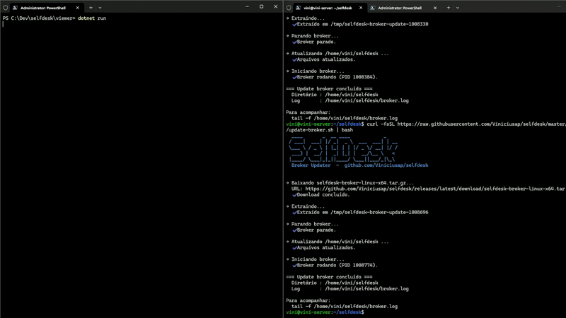

<div align="center">

# SelfDesk

**Dev-first, self-hosted remote access for your LAN.**  
An open-source alternative to AnyDesk and TeamViewer — no third-party cloud, no exposed RDP, no inbound ports on controlled machines.

[](https://github.com/Viniciusap/selfdesk/actions/workflows/ci.yml)
[](LICENSE)


[](https://github.com/Viniciusap/selfdesk/pulls)

</div>

<div align="center">



*Viewer (left) controlling a remote Windows machine via a self-hosted broker*

</div>

> **Scope:** designed for LAN / trusted networks. Not audited for direct internet exposure. For remote access over the internet, place the broker behind a VPN or tunnel.

---

## Install / Update

The same command installs or updates — your `.env` and certificates are always preserved.

```bash
# Broker — Linux, WSL, Git Bash (auto-detects platform)
curl -fsSL https://raw.githubusercontent.com/Viniciusap/selfdesk/master/scripts/install-broker.sh | bash
```

> *Windows PowerShell (no bash): `irm https://raw.githubusercontent.com/Viniciusap/selfdesk/master/scripts/install-broker.ps1 | iex`*

```powershell
# Sender — Windows (run as Administrator)
irm https://raw.githubusercontent.com/Viniciusap/selfdesk/master/scripts/install-sender.ps1 | iex

# Viewer — Windows
irm https://raw.githubusercontent.com/Viniciusap/selfdesk/master/scripts/install-viewer.ps1 | iex
```

---

## What it does

You run a small **broker** on any Linux box (a Raspberry Pi handles it fine). Your Windows machines connect outbound to it — nothing listens for inbound connections, no third-party cloud, nothing phones home.

- **Screen capture and remote control** — mouse, keyboard, scroll wheel
- **Clipboard sync** — copy on one machine, paste on the other, bidirectional
- **File transfer** — drag files onto the video surface, progress bar included
- **Wake-on-LAN** — wake offline machines from the viewer sidebar
- **Hardware H.264** — Quick Sync (Intel) or NVENC (NVIDIA) via FFmpeg, selectable by `.env`
- **Multiple senders** — control several machines from one viewer, switch with a click
- **Automatic reconnect** — exponential backoff on broker restart or network hiccup

---

## Quick start

Setup order: **broker first**, then sender, then viewer. The broker generates the `SHARED_SECRET` and `ca-cert.pem` that the other machines need.

### Step 1 — Broker

<details open>
<summary><b>Linux (recommended)</b></summary>

```bash
curl -fsSL https://raw.githubusercontent.com/Viniciusap/selfdesk/master/scripts/install-broker.sh | bash
cd ~/selfdesk
./scripts/bootstrap.sh broker
```

Note the printed `SHARED_SECRET`. Then open the firewall and start:

```bash
sudo ufw allow from <YOUR_SUBNET>/24 to any port <LISTEN_PORT> proto tcp
node dist/index.js
```

</details>

<details>
<summary><b>Windows</b></summary>

```powershell
irm https://raw.githubusercontent.com/Viniciusap/selfdesk/master/scripts/install-broker.ps1 | iex
cd $env:USERPROFILE\selfdesk-broker
powershell -File scripts\bootstrap.ps1 -Role broker
node dist\index.js
```

</details>

After the broker starts, **copy `certs/ca-cert.pem`** to each Windows machine — senders and viewers need it to verify the broker's TLS certificate.

---

### Step 2 — Sender *(machine to be controlled, Windows)*

```powershell
irm https://raw.githubusercontent.com/Viniciusap/selfdesk/master/scripts/install-sender.ps1 | iex

# Copy ca-cert.pem from the broker into C:\tools\selfdesk-sender\, then:
cd C:\tools\selfdesk-sender
powershell -File scripts\bootstrap.ps1 -Role sender
# → prompts for broker host, SHARED_SECRET, SENDER_ID, encoder (jpeg / qsv / nvenc)

.\SelfDesk.Sender.exe
```

---

### Step 3 — Viewer *(control machine, Windows)*

```powershell
irm https://raw.githubusercontent.com/Viniciusap/selfdesk/master/scripts/install-viewer.ps1 | iex

# Copy ca-cert.pem from the broker into C:\tools\selfdesk-viewer\, then:
cd C:\tools\selfdesk-viewer
powershell -File scripts\bootstrap.ps1 -Role receiver
# → prompts for broker host and SHARED_SECRET

.\SelfDesk.Viewer.exe
```

---

### Build from source

<details>
<summary>Expand</summary>

```bash
git clone https://github.com/Viniciusap/selfdesk.git
cd selfdesk
```

**Broker (Linux)**
```bash
./scripts/install.sh broker      # installs Node.js LTS if missing, compiles
./scripts/bootstrap.sh broker    # generates .env, SHARED_SECRET, certs/
sudo ufw allow from <YOUR_SUBNET>/24 to any port <LISTEN_PORT> proto tcp
cd broker && npm start
```

**Sender (Windows)**
```powershell
.\scripts\install.ps1 -Role sender     # installs .NET 10 SDK if missing, compiles
.\scripts\bootstrap.ps1 -Role sender
cd sender && dotnet run
```

**Viewer (Windows)**
```powershell
.\scripts\install.ps1 -Role receiver
.\scripts\bootstrap.ps1 -Role receiver
cd viewer && dotnet run
```

</details>

---

## How it works

```
  SENDER (C#/.NET)                BROKER (Node.js)          VIEWER (C#/WPF)
 ┌─────────────────┐         ┌──────────────────────┐     ┌─────────────────┐
 │ Screen capture  │         │ Authenticates conns  │     │ Renders stream  │
 │ Encode (JPEG /  │──TLS──▶ │ Routes by peer_id    │◀TLS─│ Captures input  │
 │ H264)           │outbound │ Never decodes video  │outbd│ Picks sender    │
 │ Inject input    │         └──────────────────────┘     └────────┬────────┘
 └────────▲────────┘                                               │
          └──────────────── INPUT_EVENT ────────────────────────────┘
```

The broker is a **dumb authenticated pipe**: it routes bytes by `peer_id` and never decodes video. Adding a second sender is pure config — no code changes.

### Security

- **TLS 1.3 on every connection** with a LAN-local CA (no public CA dependency). Clients pin the CA via `TLS_CA_PATH`.
- **HMAC-SHA256 challenge-response** — `SHARED_SECRET` never travels over the wire.
- **Zero inbound ports on Windows machines** — outbound connections to the broker only.
- **No secrets committed** — `.env`, keys, and certificates are in `.gitignore`.

Found a vulnerability? Open an issue or email vinicius.ap48@gmail.com.

---

## Configuration reference

Bootstrap generates the `.env` files for you — you rarely need to edit them by hand. The broker bootstrap prints the `SHARED_SECRET` for you to paste into the sender and viewer `.env` files.

| Variable | broker | sender | viewer | Description |
|----------|:------:|:------:|:------:|-------------|
| `ROLE` | ✓ | ✓ | ✓ | `broker` \| `sender` \| `receiver` |
| `SHARED_SECRET` | ✓ | ✓ | ✓ | Identical on all three; generated at the broker |
| `LISTEN_PORT` | ✓ | | | TLS listen port |
| `ALLOWED_SENDERS` | ✓ | | | Comma-separated list of permitted `SENDER_ID`s |
| `TLS_CERT_PATH` | ✓ | | | Path to `server-cert.pem` |
| `TLS_KEY_PATH` | ✓ | | | Path to `server-key.pem` |
| `LOG_LEVEL` | ✓ | | | `debug` \| `info` \| `warn` \| `error` |
| `SENDER_ID` | | ✓ | | Unique identifier (must be in `ALLOWED_SENDERS`) |
| `BROKER_HOST` | | ✓ | ✓ | Broker IP or hostname |
| `BROKER_PORT` | | ✓ | ✓ | Broker port |
| `TLS_CA_PATH` | | ✓ | ✓ | Path to `ca-cert.pem` (CA pinning) |
| `ENCODER` | | ✓ | | `jpeg` \| `qsv` \| `nvenc` |
| `TARGET_FPS` | | ✓ | | Capture FPS (default: `30`) |
| `JPEG_QUALITY` | | ✓ | | JPEG quality 1–100 (default: `75`) |

---

## Adding more senders

1. On the new machine, run `install-sender.ps1`, copy `ca-cert.pem`, run bootstrap with a unique `SENDER_ID` (e.g. `laptop-02`).
2. On the broker, add the new ID to `ALLOWED_SENDERS` (e.g. `laptop-01,laptop-02`) and restart.

The viewer automatically shows the new sender in the list. No code changes.

---

## Project structure

```
selfdesk/
├── .github/workflows/
│   ├── ci.yml          # broker tests (Ubuntu) + .NET build+tests (Windows)
│   └── release.yml     # builds release zips/tarballs on version tags
├── scripts/
│   ├── install-broker.sh   # broker install/update — Linux/WSL/Git Bash
│   ├── install-broker.ps1  # broker install/update — Windows PowerShell
│   ├── install-sender.ps1  # sender install/update — Windows
│   ├── install-viewer.ps1  # viewer install/update — Windows
│   ├── bootstrap.sh        # generates .env + TLS certs (Linux)
│   └── bootstrap.ps1       # generates .env + TLS certs (Windows)
├── broker/             # Node.js + TypeScript — authenticated relay
├── sender/             # C# / .NET 10 — capture + encode + inject input
├── viewer/             # C# / WPF / .NET 10 — render stream + capture input
├── shared/
│   ├── protocol/       # protocol.ts — authoritative message type constants
│   └── dotnet/         # MessageType.cs + WireProtocol.cs — C# mirror
└── selfdesk.slnx       # .NET solution (sender + viewer + tests)
```

---

## Roadmap

All core features are implemented. What's open:

| Area | Issues |
|---|---|
| Platform | [macOS support](https://github.com/Viniciusap/selfdesk/issues/1), [Linux sender](https://github.com/Viniciusap/selfdesk/issues/11), [ARM64 broker build](https://github.com/Viniciusap/selfdesk/issues/7) |
| Distribution | [Docker image](https://github.com/Viniciusap/selfdesk/issues/6), [Web viewer](https://github.com/Viniciusap/selfdesk/issues/12) |
| UX | [Multi-monitor switching](https://github.com/Viniciusap/selfdesk/issues/20), [Remote cursor shape](https://github.com/Viniciusap/selfdesk/issues/22), [Ctrl+Alt+Del](https://github.com/Viniciusap/selfdesk/issues/13) |
| Protocol | [Clipboard images](https://github.com/Viniciusap/selfdesk/issues/8), [Mic passthrough](https://github.com/Viniciusap/selfdesk/issues/21) |
| Ops | [Prometheus metrics](https://github.com/Viniciusap/selfdesk/issues/19), [Log rotation](https://github.com/Viniciusap/selfdesk/issues/18) |

See all open issues [here](https://github.com/Viniciusap/selfdesk/issues).

---

## Contributing

See [CONTRIBUTING.md](CONTRIBUTING.md) for conventions, test commands, and project structure details.

Good entry points: [`good first issue`](https://github.com/Viniciusap/selfdesk/issues?q=is%3Aissue+is%3Aopen+label%3A%22good+first+issue%22) · [`help wanted`](https://github.com/Viniciusap/selfdesk/issues?q=is%3Aissue+is%3Aopen+label%3A%22help+wanted%22)

---

## License

Distributed under the MIT License. See [LICENSE](LICENSE).

SelfDesk is intended for machines you own or have explicit authorization to access.
